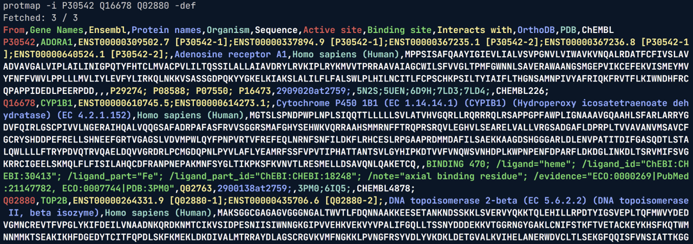

[](https://opensource.org/licenses/MIT)
[](https://github.com/astral-sh/ruff)
[](https://github.com/psf/black)
[](https://pycqa.github.io/isort/)
[](https://actions-badge.atrox.dev/David-Araripe/UniProtMapper/goto?ref=master)
[](https://pypi.org/project/uniprot-id-mapper/)

# UniProtMapper

A Python wrapper for UniProt's [Retrieve/ID Mapping](https://www.uniprot.org/id-mapping) RESTful API. This package supports the following functionalities:

1. Map (almost) any UniProt [cross-referenced IDs](https://github.com/David-Araripe/UniProtMapper/blob/master/src/UniProtMapper/resources/uniprot_mapping_dbs.json) to other identifiers & vice-versa;
2. Programmatically  retrieve any of the supported [return fields](https://www.uniprot.org/help/return_fields) from both UniProt-SwissProt and UniProt-TrEMBL (unreviewed) databases;

For these, check [Example 1](#example-1-mapping-ids) and [Example 2](#example-2-retrieving-information) below. Both functionalities can also be accessed through the CLI. For more information, check [CLI](#cli).

## Installation

From PyPI:
``` Shell
python -m pip install uniprot-id-mapper
```

Directly from GitHub:
``` Shell
python -m pip install git+https://github.com/David-Araripe/UniProtMapper.git
```

From source:
``` Shell
git clone https://github.com/David-Araripe/UniProtMapper
cd UniProtMapper
python -m pip install .
```
# Usage
## Example 1: Mapping IDs
To map IDs, the user can either call the object directly or use the `get` method to obtain the response. The different identifiers that are used by the API are designated by the `from_db` and `to_db` parameters. For example:

``` python
from UniProtMapper import ProtMapper

mapper = ProtMapper()

result, failed = mapper.get(
    ids=["P30542", "Q16678", "Q02880"], from_db="UniProtKB_AC-ID", to_db="Ensembl"
)

result, failed = mapper(
    ids=["P30542", "Q16678", "Q02880"], from_db="UniProtKB_AC-ID", to_db="Ensembl"
)
```
Where failed corresponds to a list of the identifiers that failed to be mapped and result is the following pandas DataFrame:

|    | UniProtKB_AC-ID   | Ensembl            |
|---:|:------------------|:-------------------|
|  0 | P30542            | ENSG00000163485.17 |
|  1 | Q16678            | ENSG00000138061.12 |
|  2 | Q02880            | ENSG00000077097.17 |

## Example 2: Retrieving information

The supported [return fields](https://www.uniprot.org/help/return_fields) are both accessible through UniProt's website or by the property `.fields_table`. For example:

```Python
from UniProtMapper import ProtMapper

mapper = ProtMapper()
df = mapper.fields_table
df.head()
```
|    | Label                | Legacy Returned Field   | Returned Field   | Field Type       |
|---:|:---------------------|:------------------------|:-----------------|:-----------------|
|  0 | Entry                | id                      | accession        | Names & Taxonomy |
|  1 | Entry Name           | entry name              | id               | Names & Taxonomy |
|  2 | Gene Names           | genes                   | gene_names       | Names & Taxonomy |
|  3 | Gene Names (primary) | genes(PREFERRED)        | gene_primary     | Names & Taxonomy |
|  4 | Gene Names (synonym) | genes(ALTERNATIVE)      | gene_synonym     | Names & Taxonomy |

To retrieve information, the user can either call the object directly or use the `get` method to obtain the response. For example:

```Python
result, failed = mapper.get(["Q02880"])
>>> Fetched: 1 / 1

result, failed = mapper(["Q02880"])
>>> Fetched: 1 / 1
```

Custom returned fields can be retrieved by passing a list of fields to the `fields` parameter. These fields need to be within `UniProtRetriever.fields_table["Returned_Field"]` and will be returned with columns named as their respective `Label`.

The object already has a list of default fields under `self.default_fields`, but these are ignored if the parameter `fields` is passed.

```Python
fields = ["accession", "organism_name", "structure_3d"]
result, failed = mapper.get(["Q02880"], fields=fields)
```

# CLI

The package also comes with a CLI that can be used to map IDs and retrieve information. To map IDs, the user can use the `protmap` command, accessible after installation. Here is a list of the available arguments, shown by `protmap -h`:

```text
usage: UniProtMapper [-h] -i [IDS ...] [-r [RETURN_FIELDS ...]] [--default-fields] [-o OUTPUT]
                     [-from FROM_DB] [-to TO_DB] [-over] [-pf]

Retrieve data from UniProt using UniProt's RESTful API. For a list of all available fields, see: https://www.uniprot.org/help/return_fields 

Alternatively, use the --print-fields argument to print the available fields and exit the program.

optional arguments:
  -h, --help            show this help message and exit
  -i [IDS ...], --ids [IDS ...]
                        List of UniProt IDs to retrieve information from. Values must be
                        separated by spaces.
  -r [RETURN_FIELDS ...], --return-fields [RETURN_FIELDS ...]
                        If not defined, will pass `None`, returning all available fields.
                        Else, values should be fields to be returned separated by spaces. See
                        --print-fields for available options.
  --default-fields, -def
                        This option will override the --return-fields option. Returns only the
                        default fields stored in: <pkg_path>/resources/cli_return_fields.txt
  -o OUTPUT, --output OUTPUT
                        Path to the output file to write the returned fields. If not provided,
                        will write to stdout.
  -from FROM_DB, --from-db FROM_DB
                        The database from which the IDs are. For the available cross
                        references, see: <pkg_path>/resources/uniprot_mapping_dbs.json
  -to TO_DB, --to-db TO_DB
                        The database to which the IDs will be mapped. For the available cross
                        references, see: <pkg_path>/resources/uniprot_mapping_dbs.json
  -over, --overwrite    If desired to overwrite an existing file when using -o/--output
  -pf, --print-fields   Prints the available return fields and exits the program.
  ```

Usage example, retrieving default fields from `<pkg_path>/resources/cli_return_fields.txt`:
<p align="center">
    
</p>